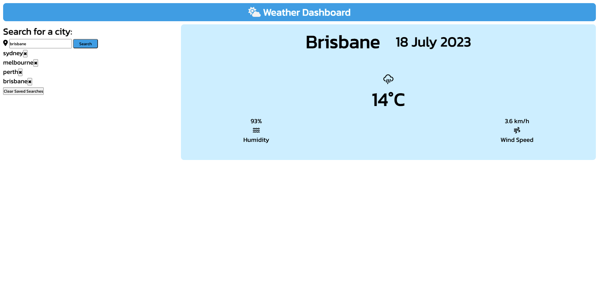

# weather-dashboard

## Table of Contents
- [Project Description](#project-description)
- [Screenshot](#screenshot)
- [Link](#link)
- [Credits](#credits)

## Project Description

This weather app allows users to search for the weather condition of their desired city. It is created using third-party API such as OpenWeather API. 

The user inputs a city name and weather details such as temperature, humidity and wind speed will show. 

## Link

[Refactored Weather Dashboard](https://hailin-ruan.github.io/weather-dashboard/)

## Screenshot

## Credits

- 
